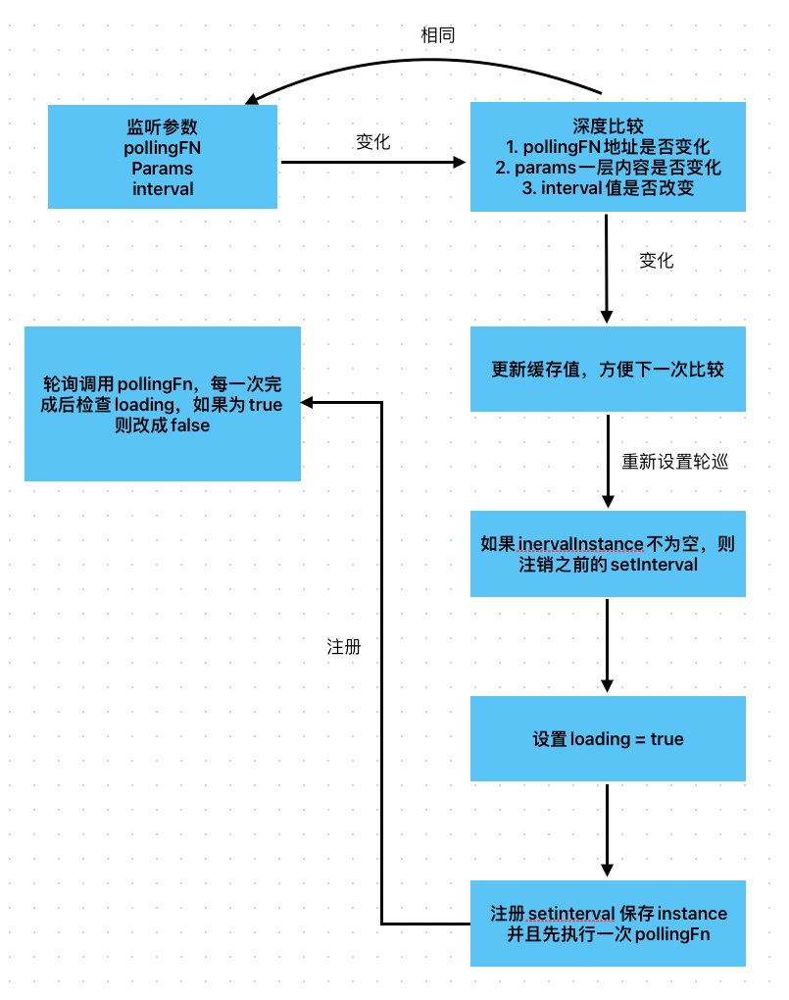

### usePolling 轮询调用任务

usePolling hook 可以帮助你快速创建轮询任务，并且帮助你处理复杂的 loading 变化。（仅在参数变动时，改变 loading 的值，避免渲染闪烁）

#### 使用方法：

```javascript

    /** 轮巡函数 */
  const pollingFn = useCallback((queryParams) => {
    // 查询
   dispatch({ type: 'fetchSystemReports', payload: queryParams });
  }, []);

  const [loading, forceUpdate] = usePolling({
    interval: 1000,
    pollingFn,
    params:{
      page: pagination.page - 1,
      pageSize: pagination.pageSize,
      paramsA,
      paramsB,
      paramsC,
    }
  });
  <Button onClick={forceUpdate}>刷新</Button>
  <Table loading={loading}>
```

usePolling 接受一个参数对象，其中包含

1. pollingFn 查询函数, 注意为了避免重复注册轮训，usePolling需要用useCallback包裹，保证每次rerender时，pollingFn的内存地址不变，因为无法对函数进行deepEqual比较
2. params 查询参数，会在调用pollingFn时传入。usePolling会监听params一层内容的变化，在hook内部会对params内部属性依次进行shallowEqual比较，所以你可以直接在使用hook时，以字面量的方式传入params，并且不必考虑params的内存地址变动
3. interval 轮训时间，默认1s,当interval变化时，也会引起usePolling重新注册setInterval任务也

#### loading
usePolling返回loading和forceUpdate，你可以直接将loading传递给需要渲染的组件
loading会在每次参数变动后的第一次渲染时被修改，后面轮训时不会改变loading的内容，保证渲染时不会出现闪烁的现象

#### forceUpdate
如果你需要强制刷新数据，请使用forceUpdate函数来保证usePolling内部的运行逻辑不被破坏，forceUpdate的本质也是改变一个内部的参数值，来达到强行重新注册任务的效果

#### 简单执行流程如下

# use-polling-hook
